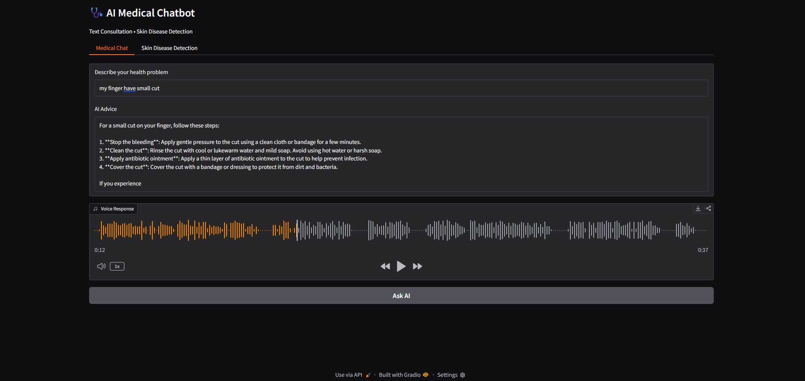
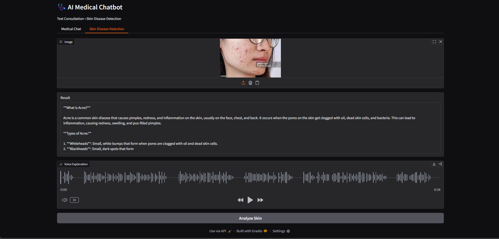

# 🩺 AI Medical Chatbot

An AI-based medical assistant that provides basic health advice using text input and skin disease image analysis.
The system uses a Large Language Model (LLM) and a computer vision model to help users understand possible health conditions and precautions.

⚠️ This project provides **general health advice only** and is **not a replacement for professional medical consultation**.

---

## 🚀 Features

* 💬 **Text-based Medical Chat**

  * Users can describe symptoms and receive simple health advice.

* 🧴 **Skin Disease Detection**

  * Upload a skin image to detect possible skin conditions.

* 🔊 **Voice Response**

  * The AI response is converted to speech automatically.

* ⚡ **Fast AI Response**

  * Powered by Groq LLM for fast inference.

---

## 🛠 Technologies Used

* **Python**
* **Gradio** – User Interface
* **Groq API** – Large Language Model
* **Hugging Face Model** – Skin Disease Detection
* **Edge-TTS** – Text to Speech

---

## 📂 Project Structure

```
ai_medical_chatbot/
│
├── app.py
├── medical_ai.py
├── voice.py
├── requirements.txt
├── .env
└── README.md
```

---

## ⚙️ Installation

1. Clone the repository

```
git clone https://github.com/Ankit231ak/Ai-medical-chatbot.git
```

2. Install dependencies

```
pip install -r requirements.txt
```

3. Add your Groq API key in `.env`

```
GROQ_API_KEY=your_api_key_here
```

4. Run the application

```
python app.py
```

---

## 🖥️ Application Interface

Below is an example of the AI Medical Chatbot interface.




---

## 📌 Disclaimer

This project is created for **educational purposes only**.
The AI provides general suggestions and should not be used for real medical diagnosis or treatment.

Always consult a **qualified medical professional** for health issues.

---

## 👨‍💻 Author

Ankit Kumar
AI / Machine Learning Student
