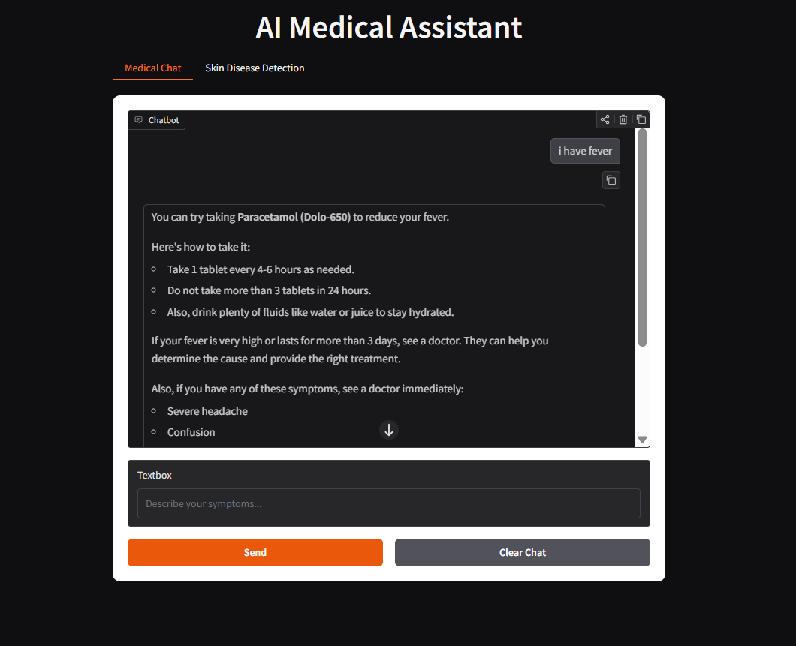
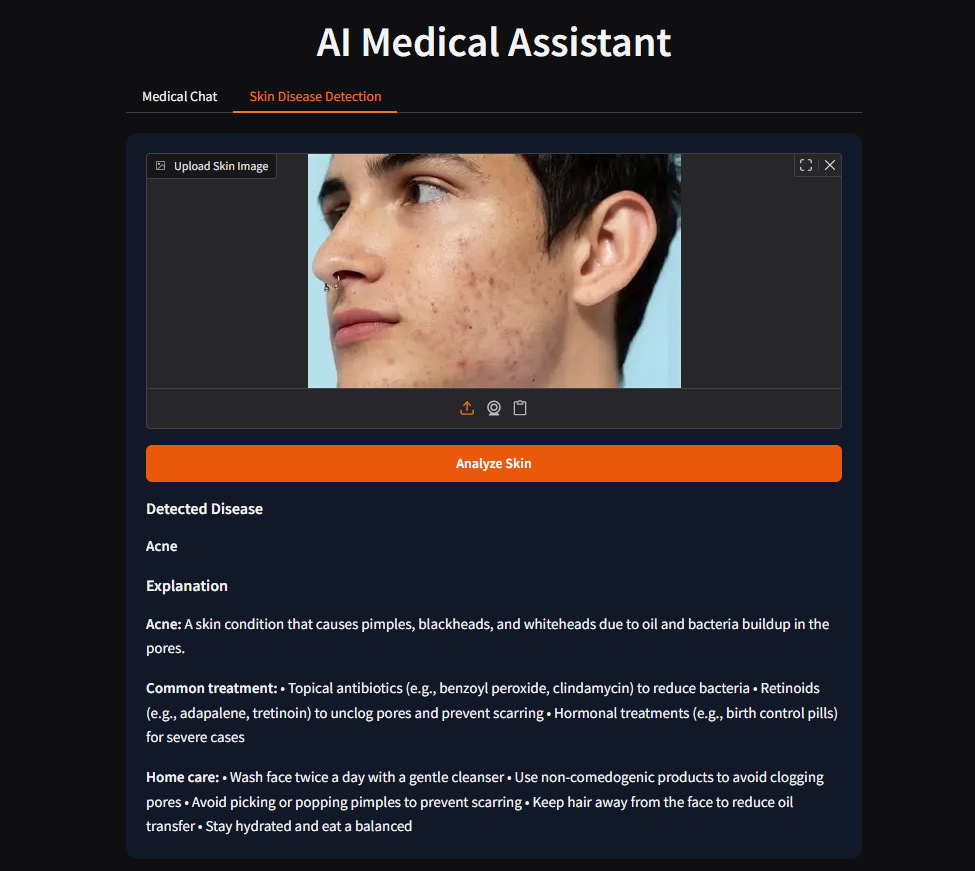

<h1 align="center">🩺 AI Medical Assistant</h1>

AI-powered medical chatbot + skin disease detection built with <b>Python, Gradio, and Groq LLM</b>.

---

## 🚀 Features

💬 **Medical Chatbot**
- Ask health-related questions
- Simple and easy-to-understand advice
- Suggests common medicines when appropriate

📷 **Skin Disease Detection**
- Upload a skin image
- AI predicts possible skin conditions
- Provides explanation and care advice

🎨 **Modern Web UI**
- Built with Gradio
- Chat-style interface

---

## 📸 Screenshots

---

## 🛠 Tech Stack

- Python
- Gradio
- Groq API (Llama 3.1)
- HuggingFace Space API
- python-dotenv

---

## ⚙️ Installation

- git clone https://github.com/your-username/ai-medical-assistant.git
- cd ai-medical-assistant
- pip install -r requirements.txt

---

## ⚠️ Disclaimer

This project provides AI-generated health information for educational purposes only.  
It is **not intended to replace professional medical advice, diagnosis, or treatment**.  

Always consult a qualified healthcare professional for medical concerns or symptoms.

## 👨‍💻 Author

**Ankit Kumar**

AI / Machine Learning Enthusiast  
Interested in building AI-powered applications and intelligent systems.